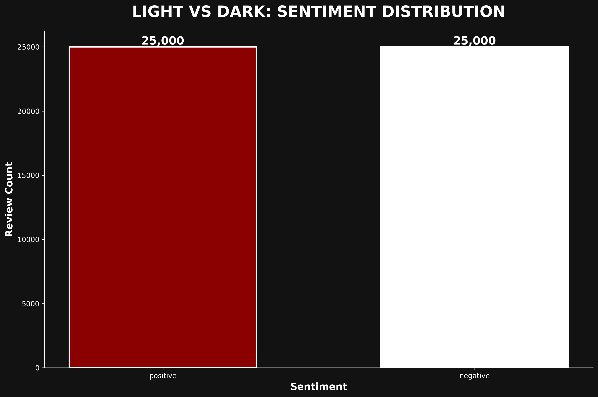
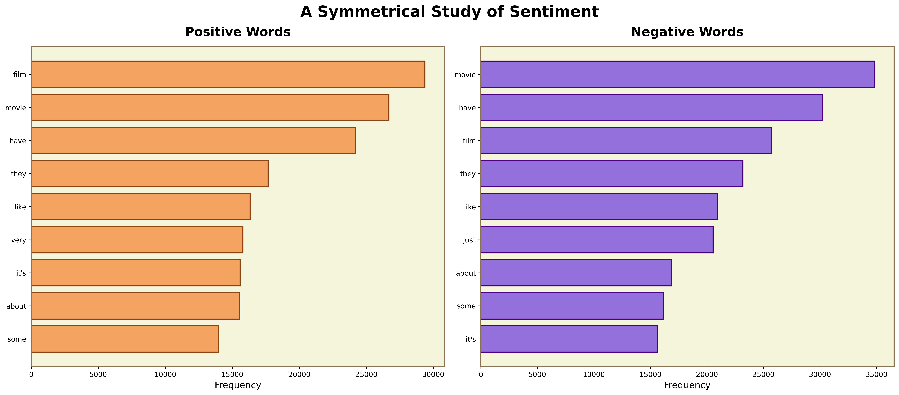

# Cinestyle


Transform your data visualizations with cinematic aesthetics inspired by iconic films. Create stunning matplotlib charts styled after Film Noir, Studio Ghibli, Wes Anderson, Blade Runner, and Star Wars.




## Features

- **5 Cinematic Styles**: Film Noir, Studio Ghibli, Wes Anderson, Blade Runner, Star Wars
- **Common Plotting Methods**: Available across all styles (line, bar, scatter, histogram, heatmap, area)
- **Signature Methods**: Unique visualizations for each cinematic style
- **Easy Integration**: Works seamlessly with existing matplotlib code
- **High Quality**: 300 DPI publication-ready output

## Installation

```bash
# Clone the repository
git clone https://github.com/Burton-David/cinematic-matplotlib.git
cd cinematic-matplotlib

# Install the package
pip install -e .
```

## Quick Start

```python
import matplotlib.pyplot as plt
from cinestyle import FilmNoir, Ghibli, WesAnderson, BladeRunner, StarWars

# Film Noir style
noir = FilmNoir()
fig, ax = plt.subplots(figsize=(12, 8))
noir.style_axes(ax)

ax.bar(['Positive', 'Negative'], [25000, 25000],
       color=['#FFFFFF', '#8B0000'])
ax.set_title("SENTIMENT DISTRIBUTION", color='white', fontsize=20)

plt.savefig('noir_viz.png', dpi=300, bbox_inches='tight', facecolor='#121212')
plt.show()
```

## Cinematic Styles

### 1. Film Noir
High-contrast visualizations with dramatic reds and whites on near-black backgrounds.

**Use cases:** Binary comparisons, dramatic contrasts, stark data splits

**Signature methods:**
- `plot_shadows()` - Light vs dark horizontal bar charts
- `plot_contrast()` - Contrasting line plots with fill areas

### 2. Studio Ghibli
Soft, calming visualizations with pastoral greens and organic aesthetics.

**Use cases:** Distributions, frequency analyses, calming presentations

**Signature methods:**
- `plot_landscape()` - Layered area charts with nature-inspired colors
- `plot_flow()` - Flowing line plots with smoothed overlays

### 3. Wes Anderson
Perfectly symmetrical layouts with carefully curated pastel palettes.

**Use cases:** Side-by-side comparisons, balanced compositions, categorical data

**Signature methods:**
- `plot_symmetry()` - Mirror bar charts with center axis
- `plot_grid()` - Symmetrical grid of colored rectangles

### 4. Blade Runner
Cyberpunk aesthetics with neon cyan and magenta on dark backgrounds.

**Use cases:** Modern/tech presentations, scatter plots, futuristic themes

**Signature methods:**
- `plot_neon_lines()` - Multiple line plots with neon colors
- `plot_matrix()` - Heatmaps with custom cyberpunk colormaps

### 5. Star Wars
Epic visualizations with bold gold and blue on pure black backgrounds.

**Use cases:** Important metrics, rankings, bold statements

**Signature methods:**
- `plot_balance()` - Light side vs dark side horizontal bars
- `plot_galaxy()` - Epic bar charts with value labels

## Common Methods (All Styles)

Every style includes these standard plotting methods:

```python
# Line plot
style.plot_line(x, y, ax=None, **kwargs)

# Bar chart
style.plot_bar(categories, values, ax=None, **kwargs)

# Scatter plot
style.plot_scatter(x, y, ax=None, **kwargs)

# Histogram
style.plot_histogram(data, bins=30, ax=None, **kwargs)

# Heatmap
style.plot_heatmap(data, ax=None, **kwargs)

# Area plot
style.plot_area(x, y, ax=None, **kwargs)
```

## Examples

### Film Noir: Sentiment Analysis

```python
import pandas as pd
from cinestyle import FilmNoir

df = pd.read_csv('IMDB Dataset.csv')
noir = FilmNoir()

fig, ax = plt.subplots(figsize=(12, 8))
noir.style_axes(ax)

sentiments = df['sentiment'].value_counts()
ax.bar(sentiments.index, sentiments.values,
       color=['#8B0000', '#FFFFFF'],
       edgecolor='white', linewidth=2)

plt.savefig('sentiment.png', dpi=300, bbox_inches='tight', facecolor='#121212')
```

### Wes Anderson: Word Frequency Comparison

```python
from cinestyle import WesAnderson
from collections import Counter

wes = WesAnderson()
fig, (ax1, ax2) = plt.subplots(1, 2, figsize=(18, 8))
wes.style_axes(ax1)
wes.style_axes(ax2)

# Positive words
ax1.barh(words_pos, counts_pos, color='#F4A460', edgecolor='#8B4513')
ax1.set_title("Positive Words", fontsize=18)

# Negative words
ax2.barh(words_neg, counts_neg, color='#9370DB', edgecolor='#4B0082')
ax2.set_title("Negative Words", fontsize=18)

plt.savefig('word_comparison.png', dpi=300, bbox_inches='tight')
```

### Blade Runner: Scatter Plot

```python
from cinestyle import BladeRunner

blade = BladeRunner()
fig, ax = plt.subplots(figsize=(12, 8))
blade.style_axes(ax)

ax.scatter(positive_x, positive_y, c='#00FFFF', alpha=0.5, label='Positive')
ax.scatter(negative_x, negative_y, c='#FF00FF', alpha=0.5, label='Negative')

ax.set_title("WORD COUNT PATTERNS", color='cyan', fontsize=20)
ax.legend(facecolor='#0a0a0a', edgecolor='#00FFFF')

plt.savefig('scatter.png', dpi=300, bbox_inches='tight', facecolor='#0a0a0a')
```

## Real-World Example

This library was used to analyze 50,000 IMDB movie reviews, creating 5 distinct visualizations:

1. **Film Noir**: Sentiment distribution showing 25,000 positive vs 25,000 negative reviews
2. **Studio Ghibli**: Review length distribution (median: 970 characters)
3. **Wes Anderson**: Top 10 positive vs negative words comparison
4. **Blade Runner**: Word count scatter plot (avg: 231 words per review)
5. **Star Wars**: Top 20 keywords across all reviews

See the [blog post](https://databurton.com/research/matplotlib-cinematic-visualizations) for full analysis.

## Project Structure

```
cinematic-matplotlib/
├── cinestyle/           # Core library
│   ├── __init__.py
│   ├── base.py          # Base class with common methods
│   ├── noir.py          # Film Noir style
│   ├── ghibli.py        # Studio Ghibli style
│   ├── wes_anderson.py  # Wes Anderson style
│   ├── blade_runner.py  # Blade Runner style
│   └── star_wars.py     # Star Wars style
├── examples/            # Usage examples
├── images/              # Example visualizations
├── notebooks/           # Jupyter notebooks
├── setup.py
├── requirements.txt
└── README.md
```

## Requirements

- Python 3.7+
- matplotlib >= 3.3.0
- numpy >= 1.19.0
- pandas (for examples)

## Contributing

Contributions welcome! Ideas for new styles:
- Tarantino (bold typography, vintage colors)
- Kubrick (symmetrical, minimalist)
- Nolan (desaturated, realistic)

## License

MIT

## Author

David Burton - [databurton.com](https://databurton.com)

## Acknowledgments

Inspired by the visual aesthetics of:
- Film Noir cinema (1940s-1950s)
- Studio Ghibli films (Hayao Miyazaki)
- Wes Anderson films (The Grand Budapest Hotel, etc.)
- Blade Runner (Ridley Scott, 1982)
- Star Wars saga (George Lucas)
