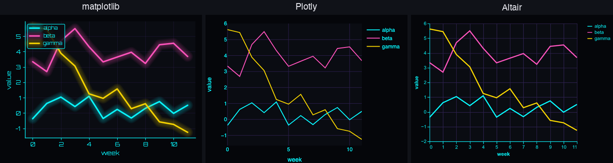
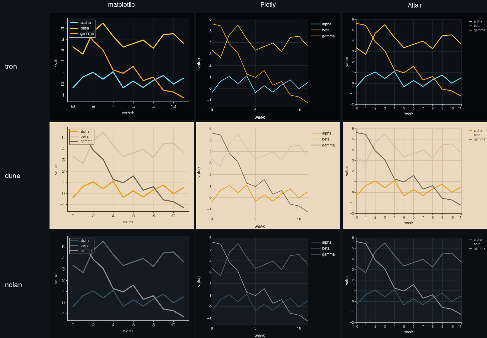
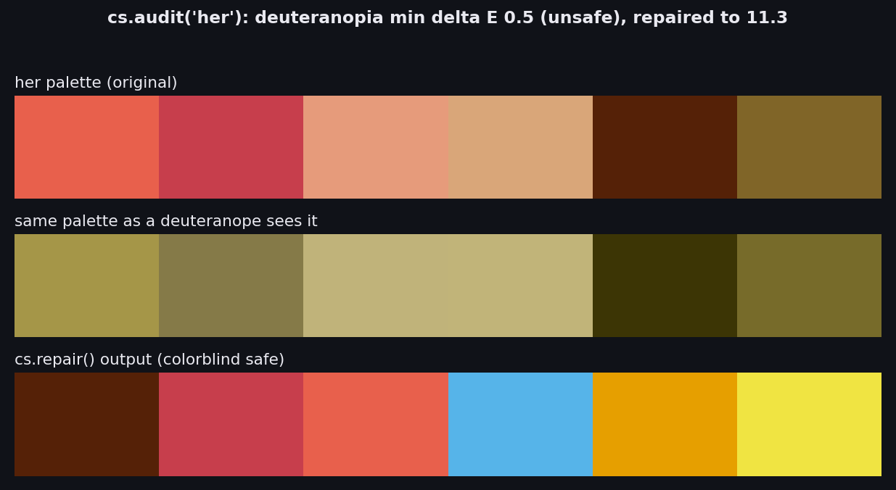

# Gallery and multi-backend proof

cinestyle defines each film look once as a theme spec, then projects that spec
onto three plotting libraries: matplotlib natively, Plotly via a registered
template, and Altair via a registered theme. The same palette, background, and
grid show up in all three. The images below are regenerated from one
deterministic script, [`scripts/multibackend_gallery.py`](../scripts/multibackend_gallery.py).

## One theme, three libraries

The `blade_runner` theme rendering the identical three-series chart in
matplotlib, Plotly, and Altair:



## Use any backend

Pick a theme name from the [table below](#themes) and apply it. The matplotlib
path is a context manager, so the styling is scoped and restored on exit:

```python
import cinestyle as cs
import matplotlib.pyplot as plt

with cs.use("blade_runner"):
    fig, ax = plt.subplots()
    ax.plot(x, y)
    ax.set_title("week over week")
```

Plotly reads cinestyle templates once they are registered. Set one as the
default, or pass it per figure with `template=`:

```python
import cinestyle as cs
import plotly.graph_objects as go
import plotly.io as pio

cs.register_plotly()
pio.templates.default = "cinestyle-blade_runner"

fig = go.Figure(go.Scatter(x=x, y=y, mode="lines"))
fig.show()  # or fig.write_image("chart.png") via kaleido
```

Altair works the same way through its theme registry:

```python
import cinestyle as cs
import altair as alt

cs.register_altair()
alt.theme.enable("cinestyle-blade_runner")

alt.Chart(df).mark_line().encode(x="x", y="value", color="series")
```

The theme spec also carries the data you usually want directly:
`cs.get_theme(name)` exposes `.palette`, `.sequential`, `.background`, and
`.foreground`, so you can read individual colors without going through any
plotting library.

## It generalizes

A neon-on-dark theme (`tron`), a warm light theme (`dune`), and a muted theme
(`nolan`), each rendered across all three backends:



## Accessibility: audit and repair

`cs.audit(name)` scores a palette for contrast and for how well its colors stay
distinct under color-vision deficiency, reported as a CIEDE2000 minimum delta E.
`cs.repair(name)` returns a colorblind-safe palette when the original fails.

The `her` palette is a clear case: its warm corals and tans collapse into nearly
one olive tone under deuteranopia, and `repair()` swaps in hues that stay
distinct.



```python
import cinestyle as cs

report = cs.audit("her")
print(report.summary())          # contrast and per-CVD delta E
print(report.safe)               # False for this palette
print(report.cvd_min_delta_e)    # {'protan': ..., 'deutan': 0.5, 'tritan': ...}

safe_palette = cs.repair("her")  # colorblind-safe replacement

# Preview what a viewer with a given deficiency sees:
seen = cs.accessibility.simulate_palette(cs.get_theme("her").palette, "deutan")
```

## A note on backend parity

The palette, background, and grid carry across all three backends. Two things do
not, by design:

- The bundled display fonts (Orbitron and similar) are loaded into matplotlib
  only. Plotly and Altair render with a system fallback font, so text in their
  output uses a plain sans face.
- The neon glow effect (`cs.add_glow`) and the film-look LUTs are matplotlib-only
  post-processing. They cannot be expressed in the Plotly or Altair theme specs,
  so those backends show the same colors without the glow.

## Themes

All 24 themes, available to every backend as `cinestyle-<name>` (Plotly, Altair)
or via `cs.use("<name>")` (matplotlib).

| Theme | Look |
| --- | --- |
| `noir` | Chiaroscuro greyscale plus a blood-red accent |
| `ghibli` | Soft Studio Ghibli pastels |
| `wes_anderson` | Grand Budapest and Zissou palettes |
| `blade_runner` | Neon cyan and magenta on near-black |
| `star_wars` | Saber blue, Sith red, gold, Tatooine sand |
| `matrix` | Monochrome digital-rain green ramp |
| `dune` | Monochrome spice-amber and dune sand |
| `fury_road` | Saturated teal and orange at the extreme |
| `kill_bill` | Bride yellow, black, and blood red |
| `in_the_mood` | Smoldering reds and golds against cool green |
| `sin_city` | Black and white plus red and yellow spot color |
| `akira` | Kaneda red over cold Neo-Tokyo night |
| `the_fall` | Hyper-saturated jewel tones on parchment |
| `tron` | Program blue versus CLU amber on the Grid |
| `amelie` | Storybook green, red, and gold |
| `the_shining` | Carpet orange and red versus Overlook blue |
| `drive` | Scorpion magenta, LA-night teal, amber on black |
| `grand_budapest` | Mendl's pinks and lavenders |
| `nolan` | Desaturated cool steel and cool-grey ramp |
| `hero` | Color-coded chapters in red, blue, and green |
| `suspiria` | Technicolor blood-red versus electric blue |
| `moonlight` | Miami-teal night with warm skin tones |
| `blade_runner_2049` | Muted cyan and teal versus amber |
| `her` | Warm corals and peach on cream |
